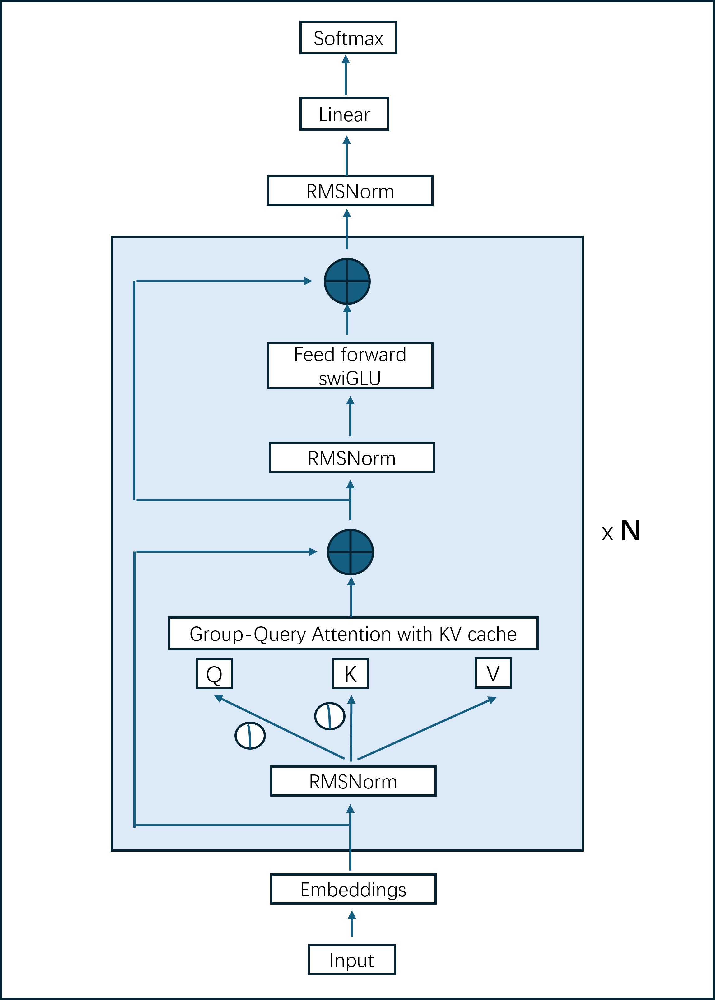

# LLM_related
**主要把自己看过的庞杂的LLM相关的技术知识做一个整理复习🚀**

## 理论相关...📚！
* 主要思路是参照Llama的模型结构来做一个梳理。Llama结构图👇

    * **Input** -- 分词相关
        * 分词算法：[BPE (Byte-Pair Encoding) & BBPE (Byte-level Byte)](transformer/docs/tokenizer.md) -- ✅
    * **归一化相关** -- [code](transformer/codes/normalization.py) & [concepts](transformer/docs/normalization.md)
        * 归一化算法
            * Layer Norm (vs Batch Norm) -- ✅
            * RMSNorm -- ✅
            * Pre-norm & Post-norm -- ✅
    * 位置编码相关 -- [code](transformer/pe.py) & [concepts]()
        * 绝对位置编码：Sinusoidal
        * 相对位置编码：ALiBi (Attention with Linear Bias)
        * 混合编码：RoPE (Rotary Positional Encoding)
    * 注意力机制相关
        * Masked attention
        * MHA (Multi-Head Attention)
        * MQA (Multi-Query Attention)
        * GQA (Group Query Attention)
        * KV-cache
        * Flash attention
        * Paged attention (vLLM)
    * FFN (Feed Forward Network)
        * SwiGLU

## 实操相关...⛏️
* 数据

## UpdateLog
[03/12/2024 Mon] Tokenization (concepts)-- ✅  
[04/12/2024 Tues] Normalization (code & concepts) -- ✅  
[11/12/2024 Wed] 修改结构
[12/12/2024 Wed] 计划：完成带kv cache和MHA,MQA,GQA梳理